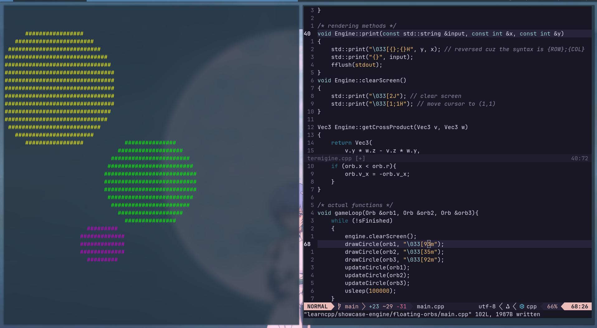

## Floating Orbs

One (of many) showcases of my custom [Terminal Graphics Engine]("github.com/randytylor69/termigine") that lives in the SSH.

|  |
| --- |
| Not one, but 3 floating orbs. Collision detection enabled. |

&nbsp;


## The (approximately accurate) Workflow

The second rendering attempt succeeded, with drastically different rendering strategy deployed than that of the first, but also much simpler: it took ~40 minutes for the second attempt (some old functions are reusable but not many), while it took me almost 2 days for the first attempt.

The correct workflow is as follows:

1. The `void drawOrb()` function uses Pythagorean Theorem to calculate the distance between any point on the screen to the centre of the orb, and compare the distance with the orb's radius. 

2. The `void updateOrb()` function only compares 4 cases: if the orb hits the top / bottom / left / right border of the terminal. The collision detection is handled as comparisons between the orb's radius, its x and y coordinates, and the size fo the border. This is much simpler than the previous attempt.

&nbsp;

The first attempt to render the floating orbs failed due to incorrect border-collision handling. The workflow looks like this:

1. The `void drawOrb()` function uses basic trigonometry to only draw an orb's border (as opposed to render a complete orb, which I did not figure out at the time), each border point becomes a vector of `<sin(theta), cos(theta)>`, with `theta` ranging from `0` to `2 * PI`.

2. A `std::thread` was set up to handle `getchar()` input alongside the infinite game loop. `CTRL+C` was dismissed as a proper termination method due to it shutting down the whole program and prevented the final execution of `engine.setCanonicalAndCursor(1)`.

3. Inside the game's `while` loop, a new `for` loop was created to modify each of the orb's coordinates based on a global `currDirection` variable. Upon collision, `currDirection` would change based on its current state.  

However, this border collision logic was too fragile; the orb constantly broke the border (as well as the program) and float into nothingness.

&nbsp;

## Build

Run the makefile:

```
make && ./main.out
```

&nbsp;
